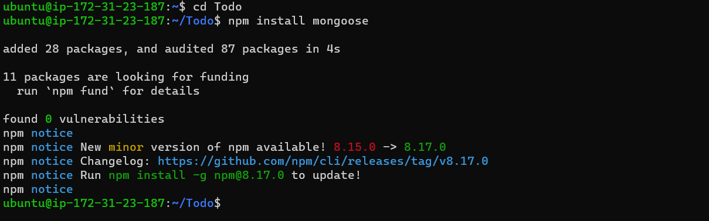
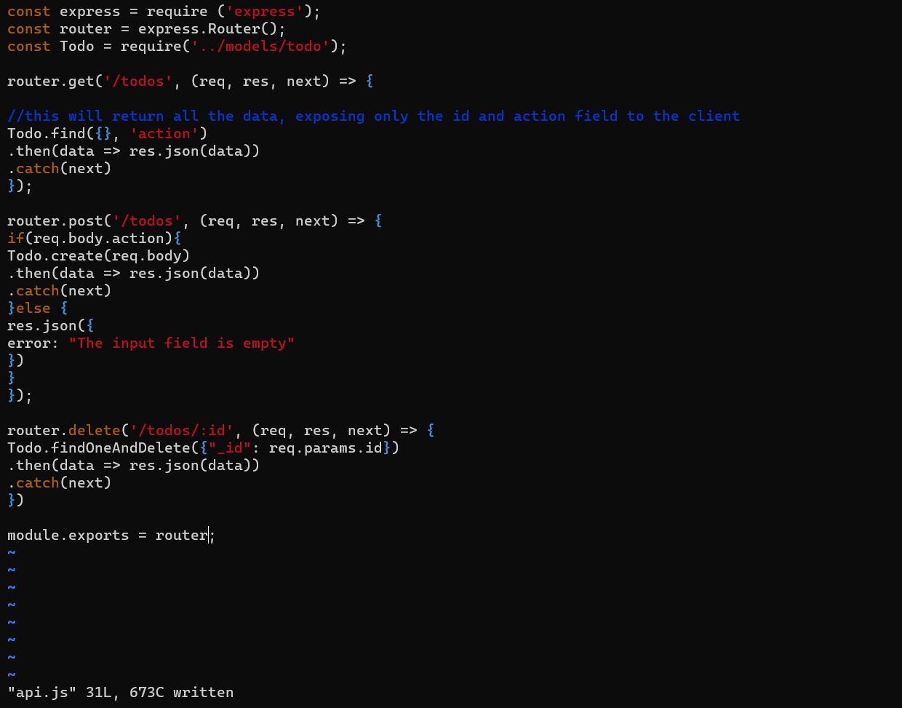
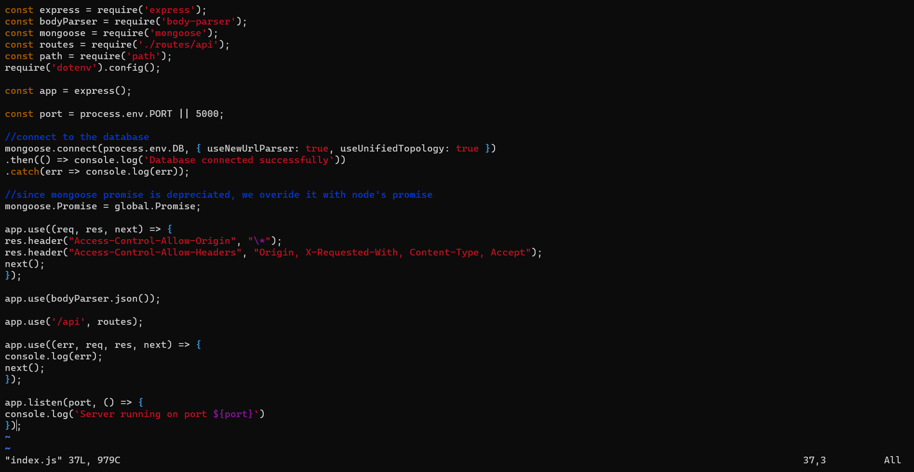

## Documentation of Project-3

Implementation of a web solution based on MERN stack in AWS Cloud

MERN *Web stack consists of following components:*

>MongoDB: A document-based, No-SQL database used to store application data in a form of documents.

>ExpressJS: A server side Web Application framework for Node.js.

>ReactJS: A frontend framework developed by Facebook. It is based on JavaScript, used to build User Interface (UI) components.

>Node.js: A JavaScript runtime environment. It is used to run JavaScript on a machine rather than in a browser.

A new instance of t2.nano family with Ubuntu Server 20.04 LTS (HVM) was created on my AWS account.

Connect to the instance and ssh into it from the terminal 

`ssh -i "project-3.pem" ubuntu@ec2-54-242-8-249.compute-1.amazonaws.com`

Once connected, Ubuntu was updated and upgraded with codes respectively

`sudo apt update`
`sudo apt upgrade`

The location of Node.js software was gotten from Ubuntu repositories

`curl -fsSL https://deb.nodesource.com/setup_18.x | sudo -E bash -`

Node.js and NPM was installed with code below. NPM is a package manager for Node like apt for Ubuntu, it is used to install Node modules & packages and to manage dependency conflicts

`sudo apt-get install -y nodejs`

Node and NPM installations were verified with the commands below respectively

`node -v`
`npm -v`

For application code setup a new directory was created for To-Do project and verified. Then directory was changed to the newly created "todo" folder. These was achieved using the codes below respectively;

`mkdir Todo`
`ls`
`cd todo`

Using the command project was initialised, so that a new file named package.json will be created. This file normally contain information about your the application and the dependencies that it needs to run

`npm init`

The above output was filed (saved) by typing yes and ls was typed to confirm package.json

Installation of ExpressJS

Express is a framework for Node.js, therefore it simplifies development, and abstracts a lot of low level details.

Express was installed, a new file *index.js* was created and confirmed, dotenv was installed with commands respectively

`npm install express`
`touch index.js`
`ls`
`npm install dotenv`

The index.js file was opened with the command and edited and saved; notice port 5000 was specified; see command and output picture

`vim index.js`

An inbound rule for port 5000 was created in the EC2 security group.

A web browser was used to access the my ip address specifying port 5000 http://54.242.8.249:5000/

To-Do application needs to be able to do:

Create a new task
Display list of all tasks
Delete a completed task

Each task will be associated with some particular endpoint and will use different standard HTTP request methods: POST, GET, DELETE.

For each task, routes were created that will define various endpoints that the To-do app will depend on. So let us create a folder routes with commands below

Created a routes directory with `mkdir routes`
Changed into the routes directoy with`cd routes`
Created the file api.js with`touch api.js`   

Open the file api.js with `vim api.js` and edited

**Models**

Mongodb is a *NoSQL* database, thus model is created.

A model is at the heart of JavaScript based applications, and it is what makes it interactive. Models is used to define the database *schema*

Directory was changed back to todo directory and Mongoose was installed with `npm install mongoose`

Models directory was created and accessed. A file Todo.js was created in the model folder with 
`mkdir models && cd models && touch todo.js`

Created file was opened and edited with `vim todo.js`

Routes from the file api.js in ‘routes’ directory was updated to make use of the new model with `vim api.js`

MongoDB Data base

A database for our data storage is needed; thus mLab was used. *mLab* provides MongoDB database as a service solution (DBaaS),so sign up for a shared clusters free account was done here https://www.mongodb.com/atlas-signup-from-mlab, AWS as a cloud provider was selected.

In the index.js file, process.env was specified to access environment variables, this file was now created.

File was created in the Todo directory and named .env with commands

`touch .env`
`vi .env`

Connection string to access the database was added

The index.js was updated to reflect the use of .env so that Node.js can connect to the database using command and was edited

`vim index.js`

Server was started using the command:

`node index.js`

*Testing Backend Code without Frontend using RESTful API*

So far the backend part of our To-Do application has been written, and a database configured, but we do not have a frontend UI yet. ReactJS code is needed to achieve this. However during development, the RESTfulL API is used to test the codes. 
Postman was downloaded and installed to test the API. It is recommended to test all the API endpoints and ensure they are working

FRONTEND CREATION

Front end is the user interface (UI) of the web browser to interact with the application via API.

Command `npx create-react-app client` was ran in the root folder (Todo dir). This creats a new in the Todo dir called *client*

Concurrently and nodemon were installed with commands 
`npm install concurrently --save-dev` and 
`npm install nodemon --save-dev` respectively. 

Concurrently is used to run more than one command simultaneously from the same terminal window while nodemon is used to run and monitor the server. If there is any change in the server code, nodemon restarts it automatically and loads the new changes.

In the Todo folder package.json file was opened and edited.

The package.json file was opened in the client directory and edited with the command `vi package.json`

Going back to the Todo dir the following command was used to start server `npm run dev`

At this point app is open and running on port 3000. hence to check this port 3000 is added to the security and public IP specifying port 3000 (http://54.242.8.249:3000/) typed into the web browser.

Creating your React Components: 
One of the advantages of react is that it makes use of components, which are reusable and also makes code modular. For our Todo app, there will be two stateful components and one stateless component.

From the Todo dir, went into clients dir, then into src dir, and componets dir was created. Inside the src dir, three files were created with the commands `touch Input.js ListTodo.js Todo.js`

The input.js file was opened with `vi Input.js` and edited

Going back to the client dir, Axios which is a Promise based HTTP client for the browser and node.js was installed with the command `npm install axios`

From the components dir, listTodo.js file was opened and edited with the command `vi ListTodo.js`

The Todo.js file was opend and edited with command 
`vi Todo.js`

From the src dir was opened and edited with the command 
`vi App.js`

Also in src directory  App.css file and index.css file were also opened and edited.

From the root folder (Todo dir) the command `npm run dev` was ran again and the public IP http://54.242.8.249:3000 was viewed on a web browser

